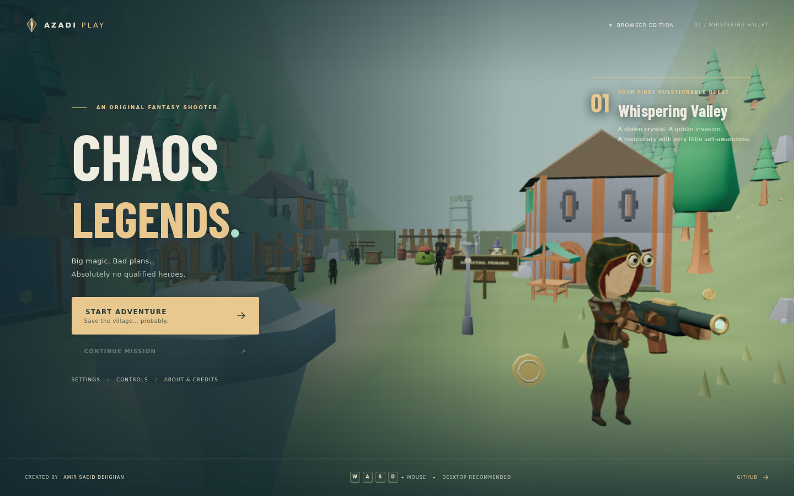
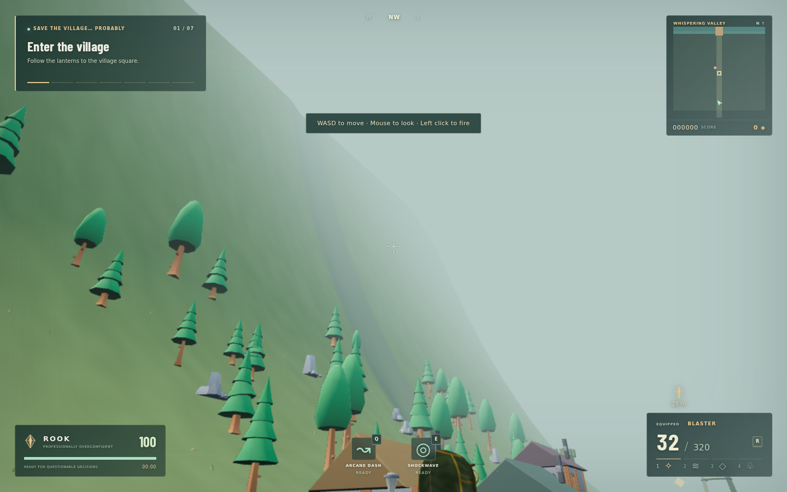

# Chaos Legends

**Big magic. Bad plans. Absolutely no qualified heroes.**

An original single-player third-person fantasy shooter made for the browser.
Play as Rook, an overconfident mercenary, and rescue Whispering Valley from a
confused goblin invasion. Created by **Amir Saeid Dehghan / Azadi Studio**.

[Play on GitHub Pages](https://saaeiddev.github.io/Chaos-Legends/) ·
[Source repository](https://github.com/saaeiddev/Chaos-Legends)

## Gameplay

Explore a sculpted valley, clear the village square, open the key chest, destroy
the barricade, cross the river bridge, defeat the Grand Gobbler, and recover the
crystal from the ruined watchtower. Look for bonus treasure off the main path.

Keep moving, use cover, and pick up ammo and health. Jump over the boss's ground
shockwave; its glowing purple shield reduces damage until it fades. Q dashes
through danger, E pushes enemies away, and V delivers a close-range strike.

## Features

- Camera-relative movement with acceleration, deceleration, sprint, crouch, jump,
  gravity, grounded checks, and collision against buildings, rocks and props.
- Smooth shoulder camera, pointer lock, aiming zoom, adjustable sensitivity,
  camera collision, recoil, and impact shake.
- Four weapons with separate magazines, reserve ammunition, fire rates, spread,
  reload timings, muzzle flashes, colored tracers, hit markers, and headshots.
- Explosive chicken projectiles with animated wings and area damage.
- Melee damage and knockback; arcane dash and shockwave with visible cooldowns.
- Animated humanoids, two-bone arm posing, original jump/fall/land poses, and
  blended movement, combat, hit and death animations.
- Six enemy roles with finite-state patrol, chase, attack, hurt, death, and
  reposition behavior. Enemy projectiles can accidentally hit other enemies.
- A complete mission with objective markers, a locked progression gate, a boss
  shield cycle, ranged volleys, ground shockwaves, and mushroom reinforcements.
- A modular fantasy village, river, bridge, hills, trees, market stalls, ruined
  towers, cover, destructible crates, chain-reacting barrels and treasure chests.
- Floating health, ammo, coins, damage boosts, shields, and the mission crystal.
- Score, combos, headshot rewards, accuracy, mission time, and a results screen.
- Main menu, continue, settings, controls, credits, pause, restart, death and retry.
- Four graphics presets, resolution scale, shadows, particles, post processing,
  sensitivity, master/music/effects volume, and local settings persistence.
- Local checkpoint saves for objectives, killed enemies, destroyed props, opened
  chests, collected field items, ammo, score, coins, health and best score.
- Original synthesized sound effects, footsteps, impacts, magic, explosions,
  UI feedback, and an arcade fantasy music sequence.
- Bundled assets, batched static scenery, instanced vegetation, pooled particles,
  reusable materials, pooled tracers and enemy projectiles, and stage-based
  visibility for enemies beyond the current area.

## Controls

| Input | Action |
| --- | --- |
| WASD | Camera-relative movement |
| Mouse | Shoulder camera orbit |
| Left click | Fire |
| Right click | Aim |
| Shift | Sprint |
| Space | Jump |
| C / Left Ctrl | Crouch |
| R | Reload |
| 1 / 2 / 3 / 4 | Switch all four weapons |
| Q | Arcane dash, 4-second cooldown |
| E | Shockwave, 9-second cooldown |
| V | Melee |
| F | Open chest / recover crystal |
| Esc | Pause / release mouse |

Click **START ADVENTURE** to play. If the browser does not grant pointer lock,
click the game canvas once. Resume also reacquires the mouse.

## Weapons

| Weapon | Magazine | Role |
| --- | ---: | --- |
| Arcane Blaster | 32 | Fast automatic magic with moderate spread |
| Goblin Boomstick | 7 | Eight-pellet close-range burst with strong knockback |
| Crystal Rifle | 6 | Accurate, slow, high-damage fire and strong headshots |
| Chicken Launcher | 4 | Animated poultry projectiles with an area explosion |

All four weapons are available from the beginning of this first mission.

## Enemies

Goblin Grunt pursues and strikes, Goblin Archer fires from range, Armored Orc is
slow and durable, Exploding Mushroom rushes and detonates, Wizard Chicken flies
and shoots, and the Grand Gobbler combines shield phases, shockwaves, volleys,
and low-health reinforcements. Humanoid enemies are adapted and tinted CC0 RPG
characters; they are not individually sculpted goblin models.

## Technology and architecture

Three.js 0.180 · WebGL 2 · Vite 6 · JavaScript ES modules · HTML/CSS · Web Audio ·
localStorage · GLB · Three.js AnimationMixer · EffectComposer.

`src/core/` owns loading, rendering, input, audio, storage, and the game state.
`src/player/` owns movement, camera, blended animation and arm posing.
`src/combat/` owns weapons, shooting, reloads and chicken projectiles.
`src/enemies/` owns enemy AI, projectiles and boss attacks.
`src/world/` owns the level, modeled art, collision, pickups and mission.
`src/effects/` owns pooled magic particles and shockwave rings.
`src/ui/` owns menus, settings, minimap, HUD and results.

Edit `src/config.js` to change the title, creator, weapon balance, or objectives.
The editable HTML entry is `client/index.html`; root `index.html` is generated.

## Installation and development

Requires Node.js 22 or newer and a recent desktop browser supporting WebGL 2.

```bash
git clone https://github.com/saaeiddev/Chaos-Legends.git
cd Chaos-Legends
npm ci
npm run dev -- --host 127.0.0.1
```

## Production build

```bash
npm test
npm run build
npm run preview -- --host 127.0.0.1
```

The build creates `docs/` and copies the same production entry and assets to the
repository root for compatibility with an existing branch-based Pages setup.
Do not edit generated `index.html`, `assets/`, or `docs/` directly. Edit `src/`,
`client/`, and `public/`, then rebuild. Git deduplicates identical asset blobs.

## GitHub Pages deployment

The Vite base is `./`, so URLs work beneath `/Chaos-Legends/` without assuming `/`.
The workflow `.github/workflows/pages.yml` installs dependencies, tests, builds,
configures Pages, uploads `docs`, and publishes with GitHub's official Pages
actions. It runs on pushes to `main` and manual workflow dispatches.

The committed production root and `/docs` build also support an existing Pages
source of `main / (root)` or `main /docs`. `.nojekyll` avoids unintended processing.
Core gameplay requires no backend, service key, CDN, or paid API.

## Validation

```bash
npx playwright install chromium
npm run build
npm run test:browser
```

Set `CHROMIUM_PATH` to use an existing Chromium binary. Set `TEST_BASE_URL` to
test the real deployment, including the trailing slash. Tests serve the local
production build below `/Chaos-Legends/` to catch base-path failures.

The browser suite checks model loading, controls, input, shooting, reload,
weapon switching, chicken flight, cooldowns, pickups, enemy damage/AI, objective
progression, chest interaction, checkpoint restore, barricade shooting, bridge
collision, boss shielding, mission completion, pause, restart, death/retry,
audio, responsive HUD and mobile fallback. Deterministic world setups accelerate
the later mission and boss checks; this is not a recorded human speedrun.
Headless pointer-lock camera input uses a synthetic relative mouse event because
CDP absolute mouse movement does not supply relative deltas consistently.

## Screenshots

Actual browser captures of the playable game:




## Asset credits and licensing

Project code is MIT. Selected Kenney and Quaternius models are CC0. Barlow
Condensed is SIL OFL 1.1. Audio is generated by the project's original Web Audio
code. Full provenance, primary source links, modifications, and bundled license
locations are in [ASSET_CREDITS.md](ASSET_CREDITS.md).

## Known limitations

- This is one stylized, arcade mission, with simplified collision and local
  steering rather than a full physics simulation or a baked navigation mesh.
- Desktop keyboard and mouse are required. Touch-only mobile devices receive
  a friendly message instead of loading the 3D level.
- Performance depends on the GPU, browser, resolution and selected effects.
  60 FPS is a target, not a verified guarantee across devices. Software WebGL
  rendering is substantially slower; choose Low and reduce resolution on weak GPUs.
- Character reactions use blended and stylized animation rather than physical
  ragdolls, facial motion capture, or motion-matched locomotion.
- Saves are browser-local mission checkpoints, not cloud saves. Random dropped
  pickups and the exact active projectile state are not preserved across reloads.
- No multiplayer, gamepad support, backend, or commercial voice acting.

## Future roadmap

More handcrafted missions, dedicated sculpted goblin characters, richer facial
animation, gamepad controls, accessibility remapping, improved pathfinding,
compressed texture variants, optional mobile controls, and expanded ambient audio.
